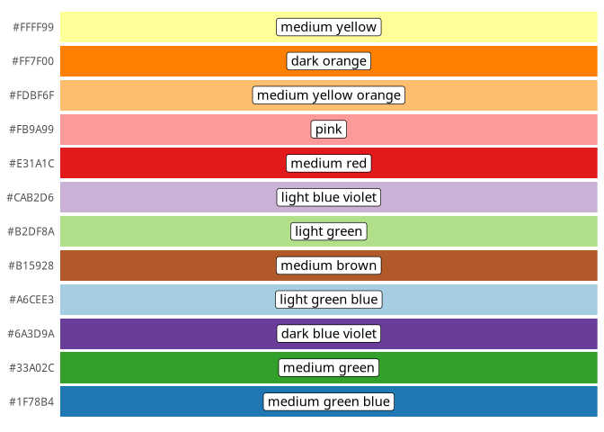

<!-- README.md is generated from README.Rmd. Please edit that file -->

# ColorNameR

<!-- badges: start -->

[](https://github.com/msanchez-beeckman/ColorNameR/actions)
<!-- badges: end -->

While coordinates in a space such as RGB or CIELab are useful to
represent colors, a descriptive name is sometimes more appropriate to
distinguish them in a qualitative way. For instance, it is commonplace
to discriminate the colors of plants, flowers, and fruits using color
charts provided by institutions like the Royal Horticultural Society
(RHS), which provide a finite number of categories to where colors can
be fit. Although these categories do not have a meaningful name, the
Union for the Protection of New Varieties of Plants (UPOV) presents a
glossary where each of them are translated to a more natural name.

ColorNameR is a small library designed to give names to colors, which is
accomplished by looking up their closest equivalent category in the RHS
and then translating its code to natural language with the UPOV
glossary. It provides the following:

  - `?name`, a function that returns the name of a color given its
    coordinates in a color space.

  - `?colordiff`, an implementation of the CIE76, CIE94, and CIEDE2000
    color distances, used to find the closest color to some reference
    CIELab coordinates.

  - `?rhs_color_values_2007`, a data set that contains approximate color
    coordinates for the categories defined by the RHS color chart in its
    fifth edition (2007).

  - `?rhs_color_names_2015`, a data set that contains names given by the
    UPOV for each RHS category in the chart’s sixth edition (2015).

## Installation

You can install the development version of ColorNameR from
[GitHub](https://github.com/) with:

``` r
# install.packages("devtools")
devtools::install_github("msanchez-beeckman/ColorNameR")
```

## Example

``` r
library(ColorNameR)
library(tibble)
library(ggplot2)
library(RColorBrewer)

palette_colors <- brewer.pal(12, "Paired")
names(palette_colors) <- palette_colors

tibble(color=palette_colors, value=1L) %>%
  dplyr::mutate(name=name(t(col2rgb(.data[["color"]])) / 255, colorspace="sRGB")) %>%
  ggplot(aes(x=color, y=value)) +
    geom_col(aes(fill=color)) +
    geom_label(aes(label=name), position=position_stack(vjust = 0.5)) +
    scale_fill_manual(values=palette_colors) +
    scale_y_continuous(limits = c(0, 1), expand = c(0, 0)) +
    coord_flip() +
    theme(legend.position="none",
          axis.title=element_blank(), axis.ticks=element_blank(),
          axis.text.x=element_blank(), panel.background=element_blank())
```


